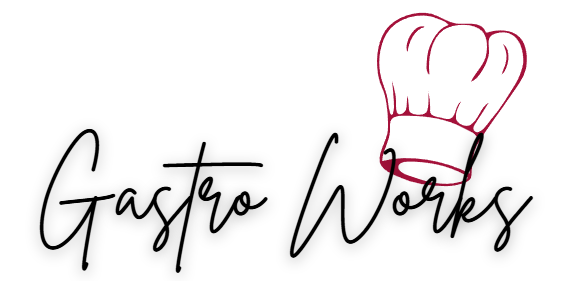

# Gastro-Works

# Convenciones de nomenclatura: 
Lower camel case
# Formato de código:
Se prohibe el uso de estilos en línea. 
# Estrategia de branches:
No se hacen commits en main. 
Los commits se hacen solo para cambios significativos.
# Estrategia de commits: 
## Los mensajes de commit siguen la convención: 
### Tipos de commit:
- New: Archivos nuevos
- Updated: Actualización de archivo. 
- Style: para cambios de formato. 
- Fix: para corrección de bugs.
- Docs: para cambios en documentación. 
- Incomplete: para guardar cambios pero aún no se ha completado el documento. 
# Instrucciones de instalación y configuración

# Dependencias y cómo instalarlas

# Comandos para ejecutar el proyecto 

# Descripción breve del proyecto 
